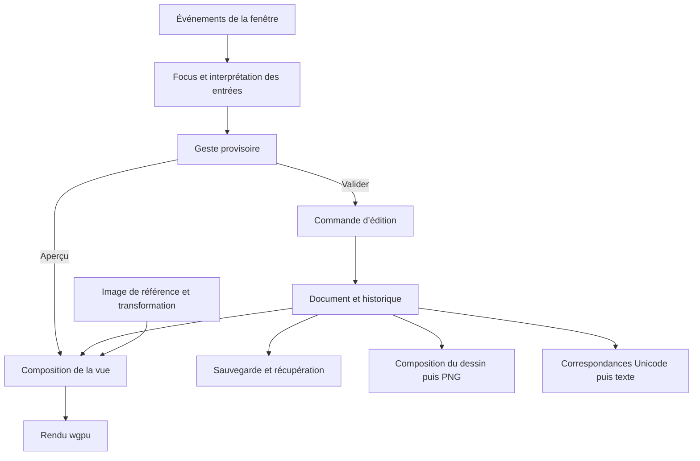

# Ditto — spécification technique V1

Version documentaire : 0.1 — 27 septembre 2026.

Ce document rassemble les décisions de la conversation et définit leur traduction technique. Il sert de référence pour préparer puis conduire l’implémentation. Le nom « Ditto » reste un nom de travail.

**État au 27 septembre 2026 : V1 implémentée.** Le moteur Rust/winit/wgpu, les outils, les fichiers et les exports sont présents. Le parcours natif macOS a été exécuté sur Apple M2 / Metal. Consulter [VALIDATION.md](VALIDATION.md) pour les preuves, plateformes et limites réellement vérifiées. Les sections « proposé » ci-dessous conservent la distinction entre choix utilisateur et choix d’implémentation.

## 1. Statut des décisions

Trois statuts sont employés :

- **Validé** : demandé ou accepté dans la conversation.
- **Conception proposée** : choix technique ou fonctionnel défini ici pour rendre la V1 réalisable, sans l’attribuer à une demande explicite.
- **À arrêter** : point à résoudre au jalon indiqué, avant de dépendre de ce choix.

| Sujet | Décision | Statut |
| --- | --- | --- |
| Produit | Éditeur de caractères pour illustrations, sprites et cartes | Validé |
| Plateformes | Application en fenêtre native macOS et Linux | Validé |
| Langage et rendu | Rust, winit et wgpu | Validé |
| Interface | Véritable grammaire visuelle de terminal dans la fenêtre : texte, cadres, grille, curseur et commandes | Validé |
| Usage | Souris et clavier d’importance égale | Validé |
| Référence fonctionnelle | REXPaint ; ne pas importer les décisions d’un autre projet | Validé |
| Référence graphique | Lain principalement, avec inspirations terminal, rétro, chrome/Y2K et Evangelion | Validé |
| Aide au dessin | Image de référence sous les caractères | Validé |
| Sorties | Texte à copier et image PNG | Validé |
| Démarrage | Choix rapide du format | Validé |
| Répertoire initial | Profil graphique inspiré du CP437, avec correspondances Unicode explicites | Conception proposée à partir de REXPaint |
| Composition V1 | Un plan de dessin et une référence indépendante | Conception proposée ; nombre de plans à confirmer |
| Formats de départ | Sprite 32 × 32, illustration 80 × 50, carte 100 × 60, dimensions personnalisées | Conception proposée |
| Nom, langue et plateformes minimales | Ditto et français dans la maquette ; versions OS et architectures à définir | À arrêter |

Le [cadrage](CADRAGE.md) conserve la recherche sur REXPaint. Cette spécification devient la référence technique. Toute évolution d’un choix validé doit être explicite ; une approximation présente dans la maquette ne constitue pas une nouvelle exigence.

## 2. Périmètre fonctionnel

### 2.1 Socle à construire

- Document à grille fixe, nouveau/ouvrir/enregistrer/enregistrer sous, redimensionnement avec aperçu du recadrage.
- Crayon, gomme, pipette, ligne, rectangle vide/plein, remplissage et texte.
- Choix du glyphe, du premier plan et du fond ; application indépendante de chacun de ces attributs.
- Sélection rectangulaire, déplacement, couper/copier/coller, annuler et rétablir.
- Prévisualisation du geste avant validation, curseur de cellule, déplacement et zoom du canevas.
- Palette de glyphes, catégories, glyphes récents et palette de couleurs modifiable.
- Import d’une image de référence avec visibilité, opacité, position, échelle et verrouillage.
- Projet autonome rééditable, brouillon de récupération, copie de texte et export PNG.
- Parcours complet réalisable à la souris et au clavier.

### 2.2 Extensions différées proposées

Animation, conversion automatique d’image en ASCII, import/export `.xp`, ANSI coloré, export ASCII strict, chargement de polices arbitraires, plusieurs plans de dessin, raccord automatique de cadres, formats de jeux, scripts et traitements par lots.

Un sprite est une composition statique. Une carte est un dessin en cellules ; elle ne porte pas de collisions, de logique de jeu ou de règles de navigation dans cette V1.

## 3. Stack et responsabilités

| Brique | Responsabilité | Limite |
| --- | --- | --- |
| Rust | Cœur documentaire, édition, outils, historique et application | Versions du compilateur et des dépendances à verrouiller avant implémentation |
| winit | Fenêtre, boucle d’événements, clavier, pointeur, focus, DPI et cycle de vie | Ne fournit pas les contrôles de l’interface |
| wgpu | Présentation GPU de l’interface, du document et de la référence | Backend Metal visé sur macOS ; Vulkan visé sur Linux, autres backends à évaluer selon les machines |
| Interface terminal maison | Mise en page en cellules, commandes textuelles, focus, dialogues internes et états | Ce n’est ni un émulateur de shell ni une application hébergée dans le terminal de l’utilisateur |
| Atlas de glyphes | Rendu déterministe des caractères du dessin | Ressource et correspondance Unicode versionnées |
| image | Décodage des références et encodage PNG | Activer seulement les formats retenus |
| serde + format JSON | Métadonnées et données documentaires sérialisables | La validation métier et la migration restent à notre charge |
| rfd | Dialogues système d’ouverture et d’enregistrement | Intégration macOS et dépendances Linux à tester |
| arboard | Presse-papiers texte du système | Comportement et durée de vie à vérifier sur Wayland/X11 |
| Conteneur ZIP | Fichier projet unique contenant les données et la référence | Bibliothèque à choisir lors du gel des dépendances |

`winit` et `wgpu` prennent en charge respectivement la fenêtre/les événements et le rendu portable. Le site wgpu documente notamment les backends natifs Metal et Vulkan. [winit](https://github.com/rust-windowing/winit), [wgpu](https://wgpu.rs/).

Les bibliothèques périphériques correspondent aux capacités documentées : [image](https://docs.rs/image/latest/image/), [Serde](https://serde.rs/), [rfd](https://docs.rs/rfd/latest/rfd/), [arboard](https://docs.rs/arboard/latest/arboard/). Les versions exactes et features Cargo seront consignées avec le premier prototype ; aucune compatibilité entre versions n’est présumée à partir des seules pages « latest ».

## 4. Architecture et circulation des données



### 4.1 Découpage logique

| Module logique | Contient | Ne dépend pas de |
| --- | --- | --- |
| Cœur | Cellules, dimensions, profil de glyphes, sélections, commandes, historique | Fenêtre, GPU, fichiers, presse-papiers |
| Application | Document actif, état modifié, tâches, récupération, orchestration | Détails des shaders |
| Interface terminal | Grille UI, composants, navigation, dialogues, routage du focus | Format physique du projet |
| Rendu | Atlas, référence, caméra du canevas, zones visibles, commandes de dessin | Logique des outils et sauvegarde |
| Entrées/sorties | Validation des fichiers, projets, images et exports | Mise en page de l’interface |
| Plateforme | Fenêtre, dialogues, presse-papiers, répertoires utilisateur et packaging | Règles de dessin |

Commencer dans un workspace Rust simple. Ces frontières peuvent être des modules avant de devenir des crates séparées : la séparation des responsabilités importe davantage que le nombre de packages.

Le document est la source de vérité. Le GPU détient des caches reconstruisibles ; aucun résultat d’édition n’existe uniquement dans une texture.

### 4.2 Exécution

- La boucle de fenêtre traite les événements, le focus, les états interactifs et la présentation.
- Le décodage d’image, l’encodage PNG et les écritures de projet s’exécutent hors du chemin de rendu, sur des tâches bornées.
- Chaque tâche travaille sur un instantané identifié par la révision du document ; son résultat ne remplace jamais un état plus récent par accident.
- Un remplacement de référence annule ou rend obsolète un chargement antérieur.
- L’interface ne redessine que lorsqu’un événement ou un état visible le nécessite. Pas de boucle à fréquence maximale permanente au repos.
- Une surface GPU perdue doit pouvoir être recréée depuis le document et les ressources conservés côté CPU.

## 5. Modèle du document

### 5.1 Données persistantes

| Élément | Contenu |
| --- | --- |
| Identité | Version de format, identifiant de document, titre |
| Géométrie | Largeur et hauteur en cellules |
| Profil de glyphes | Identifiant, version, identifiant d’atlas et dimensions natives d’une cellule |
| Dessin | Tableau dense de cellules, ordre ligne par ligne |
| Palette | Couleurs sRGB et organisation de la palette utilisateur |
| Référence facultative | Image embarquée, dimensions, transformation, opacité, visibilité et verrouillage |

Une cellule contient un identifiant de glyphe, une couleur de premier plan et un fond facultatif. Le glyphe « espace » avec fond absent est la forme canonique d’une cellule effacée. Un espace avec fond opaque reste un contenu visible.

Le premier plan et un éventuel fond sont des couleurs RGB opaques en V1. La transparence d’un fond est un état explicite, pas une couleur réservée. La transparence d’image et le masque du glyphe sont traités par la composition ; on n’introduit pas une opacité arbitraire par cellule.

La palette est une aide de sélection. Les cellules conservent leurs couleurs et ne changent pas implicitement lorsque l’on réorganise une palette.

### 5.2 État de session distinct

Outil courant, glyphe et couleurs du pinceau, attributs appliqués, curseur, sélection, geste provisoire, zoom, position de vue, focus et dialogues appartiennent à la session. Ils peuvent être mémorisés comme préférences de reprise mais ne constituent pas le dessin exporté.

Le marqueur « modifié » compare l’état documentaire courant à la révision sauvegardée. Un zoom, un survol ou un changement d’outil ne crée pas de modification documentaire.

### 5.3 Invariants

- Le nombre de cellules est exactement largeur × hauteur ; dimensions et multiplication sont contrôlées avant allocation.
- Les opérations s’expriment en coordonnées de cellules, jamais en coordonnées d’écran.
- Un indice de glyphe appartient au profil déclaré ; aucun indice inconnu n’est silencieusement remplacé au chargement.
- Une prévisualisation ne modifie ni le document ni son historique avant validation.
- Les coordonnées, tailles et opacités de la référence sont finies et dans les domaines autorisés.
- Les limites de taille et de mémoire doivent être explicites avant de rendre les importeurs utilisables.

## 6. Glyphes, polices et texte

REXPaint documente un profil CP437 de 256 glyphes, des polices bitmap et des tables de correspondance Unicode. Ditto s’inspire de cette organisation sans reprendre automatiquement les fichiers graphiques ni leurs adaptations particulières. [Manuel REXPaint, Fonts](https://www.gridsagegames.com/rexpaint/manual.txt).

### 6.1 Profil initial

- Tableau de 256 emplacements avec identifiants stables, dans l’esprit du CP437.
- Répertoire utilisable : lettres, nombres, ponctuation, symboles, traits simples/doubles, blocs et ombrages.
- Table explicite index → caractère Unicode ; les cases historiques de contrôle doivent correspondre à un symbole graphique défini ou être exclues des glyphes dessinables.
- Aucun caractère de contrôle provenant d’un indice CP437 ne peut être émis dans le presse-papiers.
- Pour les correspondances inverses ambiguës, une règle canonique stable choisit le glyphe importé. Le projet natif conserve toujours l’indice exact.
- Une police bitmap carrée distribuable est le choix initial proposé. Son nom, sa licence et sa taille seront fixés au prototype.
- Les anciennes versions d’atlas nécessaires aux projets enregistrés doivent rester disponibles ou disposer d’une migration explicite.

### 6.2 Police d’interface distincte

La police de l’interface couvre les libellés, accents et cadres nécessaires, indépendamment du répertoire dessinable. Elle utilise des métriques fixes adaptées aux écrans à forte densité. Le profil limité du dessin ne doit pas empêcher d’écrire un nom de fichier ou un titre avec accents.

### 6.3 Saisie et collage

- Interpréter le texte effectivement composé par le système ; ne pas assimiler une touche physique à une lettre.
- Réserver les raccourcis d’outils au mode dessin. En mode texte, les frappes imprimables écrivent du texte.
- Valider un bloc collé avant de le modifier : normaliser les fins de ligne, contrôler le répertoire et déterminer l’emprise.
- Présenter les glyphes incompatibles avant confirmation. Aucune suppression ni substitution silencieuse.
- Les caractères combinés ne deviennent pas deux cellules par accident : normalisation et correspondance sont résolues avant insertion ; le reste est signalé.
- Pour la V1, proposer une tabulation à quatre colonnes, avec aperçu du résultat ; cette convention reste à confirmer lors du prototype d’entrée.
- Le texte écrit remplace les cellules, sans insertion ni reflow. Entrée revient à la colonne d’origine du bloc à la ligne suivante.
- Au bord de la grille, la saisie n’agrandit pas le document. Un collage qui dépasse présente l’aperçu du recadrage et demande une confirmation ou un repositionnement.

## 7. Deux grilles et un rendu commun

### 7.1 Grille de l’interface

La fenêtre héberge une grille logique d’interface. Les composants s’y alignent : titres, cadres, commandes entre crochets, indicateurs et champs. Le routage souris repose sur des zones sémantiques de cette grille ; le focus clavier pointe vers les mêmes contrôles.

L’interface possède sa propre échelle. Elle ne change pas de taille quand l’utilisateur zoome sur le dessin. Les composants visibles restent textuels, y compris les menus et dialogues internes ; les dialogues de fichiers du système sont l’exception prévue.

### 7.2 Grille du dessin

La zone centrale possède sa caméra : translation, zoom et découpe aux limites du canevas visible. Le hit-testing applique la transformation inverse pour retrouver une cellule. Le même calcul sert aux gestes, sélections et curseurs afin d’éviter les décalages selon le DPI.

Le rendu des glyphes bitmap utilise l’échantillonnage au plus proche et un placement adapté aux pixels physiques. Les niveaux entiers sont privilégiés pour la netteté. « Ajuster à la vue » peut être fractionnaire ; ce mode ne doit pas être confondu avec une échelle native entière.

### 7.3 Ordre de composition

1. Fond de travail, extérieur aux données du dessin.
2. Image de référence, si visible.
3. Fonds des cellules qui en possèdent un.
4. Glyphes et couleurs de premier plan.
5. Aperçu de l’outil et du collage.
6. Grille d’aide, sélection et curseur.

Les couleurs de document sont enregistrées en sRGB. Le pipeline fixe les conversions et conventions alpha pour que les caches GPU et la composition PNG donnent les mêmes couleurs. L’atlas, les métriques et les règles de composition sont partagés ; un test de rendu compare réellement leurs résultats.

L’export PNG utilise une composition CPU déterministe du dessin seul puis l’encodeur PNG. Il ne dépend pas d’une capture de fenêtre, du zoom ou du matériel GPU. Le rendu GPU demeure le chemin interactif.

## 8. Interface terminal et direction graphique

### 8.1 Règles impératives

Tout l’intérieur de la fenêtre doit être lisible comme une interface de terminal : typographie monospace, cadres en traits, alignements en cellules, commandes textuelles, sélections inversées et curseur de cellule. Éviter les boutons arrondis, panneaux de type web et effets de matière qui dénaturent cette grammaire.

Lain fournit l’ambiance sombre et calme. Le chrome/Y2K se traduit par le texte argenté et les contrastes de gris. L’inspiration Evangelion apporte un accent de signalisation et une hiérarchie nette. Les couleurs du dessin restent indépendantes de celles de l’interface.

| Token proposé | Valeur initiale | Usage |
| --- | --- | --- |
| Fond | `#101014` | Surface principale |
| Surface secondaire | `#141318` | Dialogues internes |
| Texte | `#D2CFD6` | Contenu courant |
| Texte secondaire | `#A59DA9` | Informations secondaires |
| Cadre | `#5E5867` | Délimitations |
| Accent | `#E6A16D` | Outil actif et actions prioritaires |
| Argent | `#C9D2DD` | Titre et informations structurantes |

Ces valeurs viennent de la maquette et restent ajustables. Ne pas appliquer de flou, scanlines, bruit, animation continue ou effet chromé à l’œuvre. Les alertes reflètent des états réels, jamais une décoration permanente.

### 8.2 Composition de l’écran

- En haut : nom du document, état modifié, commandes Nouveau/Ouvrir/Enregistrer/Copier texte/PNG.
- À gauche : outils, palette de glyphes et attributs du pinceau.
- Au centre : dessin et aides d’édition.
- Inspecteur de référence compact et repliable, sous le canevas comme dans la maquette initiale ; une disposition latérale pourra être évaluée sur fenêtre large.
- En bas : outil/mode, coordonnées, dimensions, zoom et raccourcis contextuels.

La disposition de l’inspecteur corrige l’alternative droite/bas du cadrage : la maquette actuelle utilise le bas. Les contraintes de largeur doivent faire replier des panneaux avant de réduire les textes jusqu’à l’illisibilité.

### 8.3 Focus et accessibilité

Chaque action dispose d’un nom, d’un état et d’une commande sémantique. Tab/Shift-Tab parcourent les zones et contrôles ; les flèches parcourent une palette ou déplacent le curseur selon le focus. Échap ferme d’abord l’interaction la plus locale.

Un dialogue capture le focus, puis le restitue au contrôle d’origine à sa fermeture. Le focus reste visible et distinct de la sélection du dessin. Une infobulle complète les labels, mais aucune fonction essentielle ne dépend du survol.

Le rendu maison nécessite une exposition explicite des contrôles aux technologies d’assistance ; la solution sera évaluée au prototype. La simple présence d’une navigation clavier ne vaut pas preuve d’accessibilité système.

## 9. Démarrage et états de l’application

### 9.1 Nouveau document

Le choix rapide propose Sprite 32 × 32, Illustration 80 × 50 et Carte 100 × 60, puis deux champs de dimensions éditables. Ces profils initialisent la grille ; ils n’introduisent pas trois types de documents.

Entrée crée le document lorsque les dimensions sont valides. Échap revient à l’écran précédent. « Ouvrir un projet » est disponible sans créer de document vide. L’import de référence se fait ensuite dans l’éditeur et ne bloque jamais le démarrage.

### 9.2 États à gérer

Accueil/format, document propre, document modifié, geste provisoire, dialogue actif, chargement de référence, sauvegarde en cours, erreur récupérable et récupération de brouillon.

Un seul document actif est proposé en V1. Ouvrir ou créer un autre document avec des changements non sauvegardés présente Enregistrer / Abandonner / Annuler. Une erreur d’écriture laisse le document modifié ouvert et réessayable.

## 10. Contrat des outils

| Outil | Comportement proposé |
| --- | --- |
| Crayon | Applique le pinceau aux cellules traversées ; interpole le trajet entre événements pour éviter les trous |
| Gomme | Remet les cellules dans leur état vide, fond absent |
| Pipette | Charge le glyphe et les couleurs de la cellule sans modifier le document |
| Ligne | Deux extrémités, aperçu, rasterisation déterministe en cellules |
| Rectangle | Deux coins inclusifs, contour ou intérieur plein ; pas de raccord automatique des glyphes en V1 |
| Remplissage | Connexité quatre directions ; compare les attributs actifs du pinceau ; applique les mêmes attributs |
| Texte | Remplacement de cellules avec origine de ligne, composition et validation du répertoire |
| Sélection | Rectangle indépendant du contenu ; actions limitées à sa portée lorsqu’elle est active |

Un attribut désactivé dans le pinceau conserve la valeur déjà présente. Si aucun attribut n’est actif, l’interface indique que le pinceau n’appliquera rien.

La sélection borne les opérations de peinture et de remplissage. La pipette peut lire en dehors. Les règles de rasterisation sont identiques pour la souris et le clavier.

### 10.1 Interactions à deux points

À la souris : appui pour l’origine, mouvement pour l’aperçu, relâchement pour valider. Au clavier : Entrée pour l’origine, flèches pour déplacer l’extrémité, Entrée pour valider. Échap annule sans entrée d’historique.

Au clavier, une pression d’Entrée avec le crayon ou la gomme applique une cellule. Une action explicite de tracé continu au clavier peut être ajoutée après essai ; ne pas détourner arbitrairement les touches imprimables en mode texte.

### 10.2 Déplacement et collage

Le déplacement part d’un instantané de la sélection ; source et destination qui se chevauchent ne doivent pas provoquer de copie progressive. Source effacée et destination écrite constituent une seule commande réversible.

Le presse-papiers interne conserve les cellules et leurs couleurs. La commande explicite « Copier texte » produit la représentation système sans couleur. Lors d’un collage, l’interface distingue le bloc de cellules interne du texte externe afin de ne pas utiliser silencieusement un ancien bloc après une copie dans une autre application.

Un bloc collé est flottant jusqu’à validation. Les cases vides remplacent les cases de destination dans le mode de base ; un mode de collage transparent constitue une extension distincte. Tout recadrage au bord doit être visible et confirmé.

### 10.3 Raccourcis

Cmd sur macOS et Ctrl sur Linux pour les actions documentaires usuelles. Les lettres d’outils visibles dans la maquette sont indicatives jusqu’au prototype ; elles ne s’activent pas pendant la saisie d’un champ ou la composition du texte.

Espace + glisser déplace la vue ; les flèches déplacent le curseur quand le canevas est actif. Le déplacement de vue au clavier doit rester disponible par une commande dédiée. Ni pan ni zoom ne déplacent les cellules.

## 11. Historique et transactions

- Une commande contient l’ensemble des changements nécessaires pour appliquer et annuler un geste.
- Un trait continu, un remplissage, un déplacement, un collage ou un redimensionnement vaut une transaction.
- Une cellule touchée plusieurs fois dans un geste conserve son état initial pour l’annulation et son état final pour le rétablissement.
- Échap et la perte de capture annulent un geste encore provisoire. Le traitement d’une perte de focus ne doit jamais valider silencieusement une opération partielle.
- Une nouvelle modification après annulation supprime la branche de rétablissement.
- Le redimensionnement conserve dans l’historique les cellules recadrées tant que la transaction est disponible.
- Import/remplacement de référence, transformation et changements documentaires de palette sont également réversibles ; les ressources nécessaires sont conservées tant qu’une commande les référence.
- Le budget mémoire est borné. L’éviction retire des transactions complètes, jamais la moitié d’un geste.
- L’historique n’est pas conservé dans le projet V1 ; sa durée de vie est la session.

Le regroupement des frappes de texte doit être déterministe : fin du groupe au changement de mode, de position ou de focus. Le seuil temporel éventuel sera fixé lors du prototype.

## 12. Image de référence

### 12.1 Import et conservation

Formats initiaux proposés : PNG et JPEG. Décoder dans une tâche, traiter l’orientation de l’image et conserver une représentation canonique embarquée. Ne pas conserver uniquement un chemin vers le fichier source.

Le projet référence un identifiant de ressource interne. Remplacer l’image met à jour la ressource et ses réglages en une commande ; un échec conserve l’ancienne référence.

### 12.2 Transformation

Position exprimée dans le repère du document, échelle uniforme et dimensions sources explicites. « Contenir » et « Remplir » conservent les proportions ; l’image est centrée à l’import. La partie extérieure au document est masquée, sans détruire l’image.

Déplacement, échelle, opacité, visibilité et verrouillage sont disponibles au clavier et à la souris. L’édition de la transformation est un mode explicite pour éviter de déplacer l’image en dessinant.

### 12.3 Visibilité pendant le dessin

Les cases à fond opaque peuvent masquer la référence. Une vue d’aide « Tracé » peut réduire l’opacité d’affichage de l’ensemble du dessin pour voir à travers ces cases. Ce réglage appartient à la vue, ne change pas les couleurs des cellules et ne s’applique jamais à un export.

La référence n’appartient ni au texte copié ni au PNG du dessin. Elle n’est pas traitée comme un calque de dessin et n’entraîne aucune conversion automatique en glyphes.

## 13. Projet et sauvegarde

### 13.1 Format proposé

Un fichier `.ditto` est proposé comme conteneur ZIP versionné :

```text
document.ditto
├── manifest.json
├── drawing.json
└── assets/
    └── reference.png      # facultatif, image canonique embarquée
```

`manifest.json` porte la version, l’identité, les dimensions, le profil de glyphes, la palette et les réglages de référence. `drawing.json` conserve les cellules en ordre ligne par ligne, sans dépendance à la représentation mémoire de Rust. Le schéma exact et des fichiers exemples seront gelés avant la première implémentation de lecture/écriture.

Le JSON compressé est une proposition pour faciliter l’inspection et les migrations au début. Le passage ultérieur à un encodage binaire exigerait une nouvelle version du format, pas une modification silencieuse.

Pas de chemins absolus pour les ressources nécessaires à la réouverture. Le conteneur est lu avec des limites de taille décompressée, de dimensions et d’entrées ; ses noms internes ne servent pas de destinations d’extraction arbitraires.

### 13.2 Sauvegarde explicite

1. Produire un instantané cohérent à une révision donnée.
2. Sérialiser et écrire dans un fichier temporaire du même dossier que la destination.
3. Terminer et vérifier l’écriture, puis remplacer atomiquement la destination.
4. Mettre à jour la révision sauvegardée uniquement après réussite.

Si le document change pendant la sauvegarde, la version écrite reste celle de l’instantané et le document courant reste modifié. Si l’écriture échoue, l’ancien fichier reste la référence et le dessin demeure en mémoire.

### 13.3 Réouverture et migration

Lire et valider un document complet avant de remplacer le document actif. Un profil de glyphes manquant, une version future ou des données incohérentes produisent un message explicite. Une migration crée une copie ou attend une sauvegarde explicite ; elle n’écrase pas automatiquement la source.

### 13.4 Brouillon de récupération

Le brouillon utilise le même modèle validable dans un répertoire utilisateur dédié, distinct du fichier enregistré. Il est écrit après un délai d’inactivité borné, sans I/O à chaque déplacement de souris. Il inclut la référence nécessaire à la reprise.

Au démarrage, une récupération disponible est présentée comme telle. Restaurer ne remplace pas silencieusement un fichier utilisateur. La fermeture normale et la sauvegarde nettoient uniquement les brouillons devenus inutiles pour ce document.

## 14. Exports

### 14.1 Texte à copier

La portée est la sélection active, sinon la grille entière. Elle est indiquée avant la copie. Émettre le caractère Unicode associé à chaque glyphe, un espace pour une cellule vide et une fin de ligne LF entre les lignes.

Conserver la largeur de chaque ligne, y compris les espaces de fin ; ne pas ajouter de ligne vide finale. Ne pas envoyer les couleurs, le fond de travail ou la référence. La copie interne de cellules et la copie de texte destinée aux autres applications sont deux opérations distinctes.

La police du destinataire peut changer les proportions ou l’apparence des symboles : l’UTF-8 préserve les caractères et la structure, pas une géométrie en pixels. L’aperçu ne promet pas une fidélité identique à celle du PNG.

### 14.2 PNG

- Export de toute la grille en V1 ; recadrage à la sélection éventuel différé.
- Dimensions en pixels = dimensions en cellules × dimensions natives du glyphe × facteur entier choisi.
- Facteurs initiaux proposés : ×1, ×2, ×4, sous réserve des limites mémoire.
- Fond global transparent ou couleur choisie ; les fonds opaques des cellules restent opaques dans les deux cas.
- Glyphes composés avec l’atlas du document et leur couleur ; échantillonnage au plus proche.
- Aucun curseur, sélection, outil, référence, grille, pan, zoom ni atténuation de la vue « Tracé ».
- Vérification des dimensions et du coût mémoire avant allocation ; écriture sûre de la destination.

Exporter ne marque pas le projet comme enregistré. Une erreur ou l’annulation du sélecteur de destination ne modifie pas le document.

## 15. Intégration macOS et Linux

### 15.1 macOS

Livrable visé : `.app` lançable depuis Finder. Intégrer l’ouverture de documents, le menu applicatif, Cmd pour les raccourcis, le presse-papiers et les dialogues. Vérifier écrans Retina, changement d’écran, composition du clavier et reprise après veille.

`rfd` documente l’intégration des dialogues asynchrones avec une application fenêtrée et recommande de les initier depuis le thread principal. Cette contrainte doit être respectée dans l’adaptateur. [Documentation rfd](https://docs.rs/rfd/latest/rfd/).

Architecture Apple Silicon prioritaire proposée. Support Intel, version minimale, signature et distribution externe restent à définir ; la compilation seule ne prouve pas la compatibilité d’une `.app` distribuée.

### 15.2 Linux

Tester les chemins Wayland et X11 retenus, le facteur d’échelle, la composition clavier, le presse-papiers, les dialogues et le backend GPU. Le conditionnement doit décrire ses dépendances réelles.

La documentation `rfd` propose des backends GTK et XDG Desktop Portal. Le choix de build et les composants présents sur les distributions cibles seront vérifiés avant packaging. [Documentation rfd](https://docs.rs/rfd/latest/rfd/).

La durée de vie du service de presse-papiers et le comportement après fermeture de l’application font partie de la recette. Ne pas confondre la sélection primaire Linux avec la copie explicite du texte.

## 16. Performance et limites

Ce sont des objectifs de conception, pas des résultats mesurés : interaction fluide, lancement court, consommation au repos faible et comportement prévisible sur de grandes grilles.

- Dessiner uniquement la partie visible du document ; regrouper les cellules et glyphes plutôt que soumettre une commande GPU par caractère.
- Mettre à jour les zones modifiées et réutiliser atlas et textures tant que leurs ressources ne changent pas.
- Éviter les copies complètes de grille par mouvement de souris ; utiliser des différences par transaction et des instantanés aux frontières nécessaires.
- Borner le remplissage, la taille des images importées, la grille, l’export et l’historique.
- Profiler séparément coût des entrées, modification de grille, préparation du rendu, GPU, décodage et export.

Le prototype fixera les valeurs numériques sur une machine identifiée : dimensions maximales, mémoire d’historique, limite de pixels d’image, taille d’export, temps de lancement et délai visible d’une entrée. Ces limites feront partie du format et des erreurs documentées avant livraison.

## 17. Plan de réalisation

| Phase | Résultat attendu | Condition de sortie |
| --- | --- | --- |
| P0 — fondations risquées | Fenêtre winit/wgpu, interface terminal minimale, deux grilles, saisie et référence de démonstration | Preuve réelle de rendu net, focus et interactions sur macOS/Linux ; dépendances et police fixées |
| P1 — cœur d’édition | Document, outils de base, sélection, commandes et historique | Gestes souris/clavier équivalents, annulation exacte et tracés continus |
| P2 — référence | Import, transformation, opacité, verrouillage et vue Tracé | Alignement invariant au zoom ; aucun effet sur les cellules |
| P3 — cycle documentaire | Projet autonome, sauvegarde, réouverture et récupération | Round-trip sans perte, fichier déplacé réouvrable, échecs d’écriture récupérables |
| P4 — sorties | Texte copiable et PNG | Tables de caractères vérifiées, couleurs/proportions fidèles, référence absente |
| P5 — intégration | Parcours complet, plateformes, performance et packaging | Recette réelle complète sur les cibles retenues et livrables lançables |

Une première tranche verticale doit exister tôt : créer une grille → tracer → annuler → sauvegarder → rouvrir → exporter. Ne pas attendre la finition de tous les outils pour prouver ce parcours.

## 18. Validation

### 18.1 Cœur et fichiers

- Rasterisation et recadrage aux bords, déplacement avec chevauchement et remplissage borné.
- Annuler puis rétablir retrouve exactement les cellules, dimensions et ressources précédentes.
- Sauvegarder/rouvrir préserve indices de glyphes, couleurs, palette et référence.
- Charger un fichier invalide ou trop grand laisse le document actif intact.
- Saisie et collage incompatibles sont signalés avant modification ; aucun contrôle CP437 n’est copié.

### 18.2 Rendu et sorties

- Jeu de référence contenant tous les glyphes dessinables, traits connectés, blocs, couleurs extrêmes et fonds transparents/opaques.
- Comparaison du canevas et du PNG avec les aides désactivées, aux facteurs d’échelle retenus.
- Référence alignée après pan, zoom, redimensionnement de fenêtre et changement de DPI.
- Texte copié avec largeur, espaces et retours à la ligne attendus ; rendu vérifié dans une application externe.
- PNG inspecté dans une autre application, avec et sans fond global.

### 18.3 Recette utilisateur réelle

1. Créer un sprite à partir du choix rapide.
2. Importer et positionner une référence.
3. Dessiner une partie à la souris et une autre au clavier.
4. Sélectionner, déplacer et annuler une zone.
5. Enregistrer, fermer, déplacer le fichier et le rouvrir.
6. Copier le texte et exporter un PNG.
7. Vérifier l’absence de la référence et des aides dans les sorties.
8. Rejouer le parcours sur macOS et les environnements Linux retenus.

Un build réussi ou des tests de cœur ne remplacent pas cette recette. Chaque preuve doit préciser OS, matériel, version du binaire, scénario et résultat ; les limitations restantes restent visibles.

## 19. Décisions à clôturer

| Point | Valeur de travail | Échéance |
| --- | --- | --- |
| Nombre de plans de dessin | Un, plus une référence | Avant stabilisation du modèle documentaire |
| Police et profil CP437 | Atlas carré, table Unicode complète et versionnée | P0 |
| Versions des dépendances et toolchain | Versions compatibles verrouillées et Cargo.lock | P0 |
| Accessibilité système | Adaptateur sémantique à évaluer | P0 |
| Plateformes minimales | Apple Silicon prioritaire ; distributions et architectures Linux à choisir | Début P0 |
| Limites chiffrées | Mesures sur grilles et images représentatives | P0, puis calibration P5 |
| Schéma `.ditto` | ZIP + JSON + référence embarquée | Avant P3 |
| Détails d’entrée | Raccourcis, tabulations, regroupement du texte, perte de focus | P0/P1 |
| Nom, langue, palette finale | Ditto, français, couleurs de la maquette | Avant finition P5 |
| Distribution | Signature macOS, format Linux et dépendances | Avant packaging P5 |

Ces points ne rouvrent pas les choix confirmés de fenêtre native, stack Rust/winit/wgpu et interface véritablement terminal.

## 20. Références et livrables existants

- [Cadrage produit et recherche REXPaint](CADRAGE.md).
- [Source de la maquette interactive](design/ditto-terminal.html).
- [Prévisualisation autonome de la maquette](design/ditto-terminal-preview.html).
- [REXPaint : présentation des fonctions](https://www.gridsagegames.com/rexpaint/features.html).
- [REXPaint : manuel](https://www.gridsagegames.com/rexpaint/manual.txt).
- [winit](https://github.com/rust-windowing/winit), [wgpu](https://wgpu.rs/).
- [image](https://docs.rs/image/latest/image/), [Serde](https://serde.rs/), [rfd](https://docs.rs/rfd/latest/rfd/), [arboard](https://docs.rs/arboard/latest/arboard/).

Les sources techniques ont été consultées pendant le cadrage du 27 septembre 2026. La maquette illustre le style et quelques transitions ; ses contrôles, approximations de police et limites de taille ne sont pas une implémentation du contrat décrit ici.

## 21. Décisions d’implémentation de la V1

- Rust 1.88 minimum déclaré ; compilation et vérifications réalisées avec Rust 1.97.0.
- winit 0.30.13, wgpu 24.0.5, image 0.25.10, rfd 0.17.2, arboard 3.6.1 ; graphe complet verrouillé dans Cargo.lock.
- AccessKit 0.25.0 / adaptateur winit 0.34.0 pour l’arbre sémantique, les actions et les champs système.
- Un plan de dessin et une référence indépendante. Profil `ditto-moderndos-square-v1`, Modern DOS 8×16 avec duplication horizontale pour les cellules de dessin 16×16. Licence et source dans `assets/`.
- Grille maximale 512×512 ; référence maximale 2048×2048 / 32 Mio ; PNG limité à 64 millions de pixels ; historique 64 Mio.
- Format `.ditto` version 1 : conteneur ZIP, `manifest.json`, `drawing.json` et `assets/reference.png` facultatif. Pas de chemins absolus ni de dépendance à l’image source. Le titre est le nom du fichier ; pas d’identifiant documentaire supplémentaire dans ce premier schéma.
- La saisie de texte est annulable par événement de texte composé ; le regroupement temporel des frappes reste différé.
- La V1 refuse un collage hors grille jusqu’à repositionnement ; aucun recadrage automatique du bloc collé.
- L’interface utilise une police bitmap CP437 et des substitutions typographiques usuelles. Le rendu arbitraire d’alphabets non couverts dans les labels reste une limite ; les chemins système conservent leur encodage natif.
- Le répertoire complet passe en deux pages dans les fenêtres basses ; fenêtre minimale 1120×720.
- Pas d’association Finder au double-clic installée. Les documents s’ouvrent via l’interface, glisser-déposer ou argument de lancement.
- Scripts de packaging local macOS/Linux et workflow CI fournis. Aucune publication ou exécution distante de ce workflow.

Le [README](README.md) décrit les commandes utilisables et [VALIDATION.md](VALIDATION.md) indique la couverture réelle. Ces précisions priment sur les options de conception antérieures lorsqu’elles diffèrent.

## 22. Extension 0.2 : édition clavier et charsets

L’utilisateur a demandé le basculement souris/clavier dans la barre supérieure, un
sélecteur de charset à la place du répertoire en mode clavier, le mapping des chiffres
et caractères spéciaux en plus des lettres, et davantage de blocs/ombrages.

La [spécification de cette extension](docs/CLAVIER-CHARSETS.md) décrit les six charsets,
le mapping clavier (révisé en 0.4.1 ci-dessous), le curseur de remplacement, le répertoire de 665 glyphes
et la compatibilité des projets V1/V2. Cette extension remplace la restriction CP437
stricte des sections de conception initiales sans changer les indices ni le rendu
des 256 glyphes historiques.

## 23. Police de l’interface et du dessin — version 0.3

À la demande de l’utilisateur, SF Mono remplace le rendu bitmap principal dans
l’interface, le dessin et les exports PNG. Les lignes et colonnes sont conservées,
avec des cellules 8×16 respectant les proportions naturelles de la police, choix confirmé par l’utilisateur.

Fontdue rasterise SF Mono Regular chargée localement, dans un atlas suréchantillonné
4× avec gouttières transparentes. Le GPU utilise un échantillonnage linéaire ;
l’export CPU applique les mêmes couvertures et compose les alpha du texte.
Les lettres sont antialiasées. Les symboles non couverts par SF Mono conservent un
repli géométrique/bitmap. Aucune copie du fichier de police Apple n’est embarquée.

Les projets V1/V2 restent importables sans changement de leurs cellules. Les sauvegardes
V3 portent le profil `ditto-sfmono-v3`. La référence possède un ratio de pixels explicite
qui permet aux nouveaux imports de conserver leurs proportions physiques sur la grille
rectangulaire. Les anciennes références gardent leurs coordonnées logiques ; Contenir
ou Remplir les recale avec les métriques actuelles.

Sous Linux, la police est résolue depuis un fichier local (`DITTO_FONT_PATH` prioritaire),
SF Mono installée, puis une monospace système. Le rendu dépend donc de la police
disponible sur la machine. Les identifiants des 665 glyphes restent stables.

## 24. Raccords graphiques sans interligne — 0.3.1

À la demande de l’utilisateur, les marges verticales sont supprimées pour les
caractères graphiques du dessin : traits, blocs, ombrages, sextants et braille.
Ces caractères utilisent les masques de cellule plutôt que les marges typographiques
du fichier SF Mono. L’extrusion des texels de bord dans les gouttières prévient aussi
les coutures de filtrage à fort zoom. Les lettres conservent SF Mono et les métriques
8×16 ; les données du document et le format V3 sont inchangés.


## 25. Shaders non destructifs — 0.4.0

Une fenêtre Shaders (F7) présente un aperçu avant/après et une pile de huit effets
maximum, sélectionnés parmi neuf traitements : glow, brillance, couleurs, duotone,
scanlines, motif, aberration chromatique, grain et vignette. Les effets sont
réordonnables, désactivables et annulables. Quatre looks sont intégrés et les
recettes peuvent être enregistrées dans des fichiers `.ditto-shaders`.

Le document conserve les cellules originales et la pile indépendante. Les
transactions de shaders ont un historique spécifique de recettes, sans snapshots
des cellules. Le format de sauvegarde passe à V4 ; V1/V2/V3 restent lisibles.
Le profil de glyphes reste inchangé.

Les cellules sont rasterisées avec les masques communs au canevas et au PNG,
puis traitées sur le GPU par le même WGSL pour l’aperçu et l’export. Trois textures
intermédiaires permettent d’enchaîner les effets ; le glow ajoute un flou séparable
avant la composition. Le résultat et la rasterisation source sont mis en cache.
Les paramètres spatiaux utilisent les pixels du document, mis à l’échelle à
l’export. Le fond opaque éventuel est ajouté en dernier.

La référence, les guides et le texte copié ne sont pas modifiés par ces effets.
Le détail des commandes, du pipeline, des bornes de validation et des limites
est dans [docs/SHADERS.md](docs/SHADERS.md).


## 25. Charsets directs et braille sélectionné — version 0.4.1

Les touches sources sont désormais limitées aux 26 lettres et dix chiffres. Les lettres
suivent la disposition active ; les positions physiques de la rangée numérique activent
0–9 sans Maj sur AZERTY. Cette normalisation intervient avant le mapping, uniquement
lorsque le canevas clavier détient le focus. Champs, IME et commandes système gardent
leur routage normal ; Option/AltGr ne déclenchent pas de mapping.

Les banques ont des plages explicites : les presets usuels sont paginés par 36 glyphes,
le braille possède quatre banques nommées par hauteur (12/17/22/15 formes). Les formes
couvrent colonnes fines/doubles, positions verticales, diagonales et remplissages avec
leurs symétries. A/Z/E conservent les colonnes gauche/droite/double à chaque hauteur.
La table UI ne montre que les correspondances affectées et tient en fenêtre compacte.

Le catalogue de 665 glyphes, les identifiants enregistrés, SF Mono, les proportions de
cellule et le pipeline de shaders restent inchangés. Le répertoire souris expose
toujours les 256 brailles. Aucun changement du format V4 n’est nécessaire.


## 26. Navigation MacBook et zoom progressif — version 0.4.2

Cmd + flèche haut/bas sur macOS (Ctrl sur Linux) change la banque du charset sans
Fn, avec bouclage. Le raccourci est actif en édition clavier et reste inactif dans
les dialogues et compositions IME. Les flèches simples déplacent toujours le curseur.
L’indication figure dans le panneau des touches et l’aide ; Page précédente/suivante
reste disponible.

Le scroll utilise désormais son amplitude : facteur exponentiel exp(0,05 × lignes)
pour la molette, exp(0,001 × pixels logiques) pour le trackpad. La conversion depuis
les pixels physiques neutralise le facteur Retina. Les petites distances ne sont
plus filtrées ni converties en sauts de 25 %. Les dimensions et l’origine du canevas
restent fractionnaires pendant le zoom afin de conserver l’ancrage sous le pointeur
sans dérive liée aux arrondis. Le résultat dépend de la distance totale plutôt que
du nombre d’événements. Les boutons +/− conservent leurs pas de 25 %, les bornes de
1 à 128 points par cellule restent communes, et le document n’est jamais modifié.


## 27. Netteté des shaders — version 0.4.3

La source de l’aperçu shader est rasterisée à la résolution complète de l’atlas
SF Mono, ×4, au lieu de subir une réduction obligatoire à 8×16 par cellule. Le cache
inclut cette résolution ; les passes reçoivent le même facteur afin de conserver
la taille des effets. Les budgets et replis des très grandes grilles sont détaillés
dans le guide shaders.

La composition finale filtre les texels du dessin en alpha prémultiplié puis retrouve
l’alpha droit attendu par le mélange de la fenêtre. Ce filtrage évite les contours
assombris par les pixels transparents ; l’atlas UI conserve son propre chemin de rendu.
Le flou du glow utilise des échantillons contigus, afin que le suréchantillonnage ne
crée pas de trous périodiques dans les halos. Les mêmes passes WGSL servent à l’export.
Le format V4, la police choisie et les cellules du projet ne changent pas.


## 28. Navigation dans l’aperçu shaders — version 0.4.4

L’aperçu possède un état de vue de session indépendant : échelle optionnelle
(ajustement automatique si absente), déplacement et geste de glisser temporaire.
Le calcul du rectangle affiché est partagé par le rendu et les interactions pour
que le zoom reste ancré sous le pointeur. Le scroll n’est envoyé à cette vue que
lorsque le pointeur est dans l’aperçu ; les autres dialogues restent isolés.

Le panneau expose −/+, le pourcentage, Ajuster et 100 %, avec raccourcis +/−, 0, 1
et Alt + flèches. Le bouton gauche déplace la vue, sans outil de peinture ni touche
Espace. Fin de clic, perte de focus et changement de panneau arrêtent le geste.
Les réglages, le comparateur et les réouvertures conservent le cadrage ; charger
un nouveau document le réinitialise. Cette navigation ne modifie pas le document
et ne recalcule pas les textures : elle transforme uniquement le rectangle de
composition, découpé à la zone de l’aperçu.


## 29. Blur et Blur des contours — version 0.4.5

Deux types d’effets complètent le catalogue, qui compte onze entrées. Blur expose
un rayon et deux facteurs d’axe. Blur des contours expose un rayon, un seuil et une
douceur de sélection. La limite de huit effets empilés reste inchangée.

Le GPU calcule un flou gaussien séparable en alpha prémultiplié, puis compose avec
la source suivant le mélange. Pour les contours, la composition utilise le contraste
local du voisinage lissé comme masque progressif, en couleur et en alpha ; les zones
à faible contraste conservent leur source. Les trois textures existantes sont réutilisées,
sans copie des cellules ni nouveau format d’image. Les passes de Glow et les anciens
identifiants d’effets sont conservés. Les exports exécutent le même pipeline.

Le format de projet reste V4 ; les nouveaux types sérialisés `blur` et `contour_blur`
sont lus à partir de 0.4.5. Un ancien lecteur les rejette explicitement. Le catalogue
occupe une quatrième ligne et le panneau adapte la hauteur de l’aperçu ; les noms
complets et les boutons de réordonnancement restent accessibles en fenêtre compacte.


## 30. Compléments braille — version 0.4.6

La banque 2 points ajoute quatre angles sur ses deux rangées inférieures
(K/L/M/W : ⡤/⢤/⣄/⣠) et leurs quatre variantes hautes, à la suite des mappings
existants. A/Z/E restent les colonnes gauche/droite et le rectangle plein bas.

Les banques 3 et 4 points ajoutent chacune neuf combinaisons d’extrémités haut/bas :
une colonne gauche, droite ou deux colonnes à chaque extrémité. Les rangées entre
ces extrémités restent vides. La hauteur désigne leur étendue verticale totale ;
les motifs de hauteur 3 sont alignés en bas de la cellule. Les symétries se vérifient
à l’intérieur de cette étendue, indépendamment de sa position dans la cellule.

Les effectifs deviennent 12/25/31/24, soit 92 motifs. Aucun mapping existant n’est
déplacé et aucune banque ne dépasse les 36 sources directes. Les identifiants de
glyphes et les dessins enregistrés restent identiques ; aucun format ne change.


## 31. Pages braille Espacés — version 0.4.7

Les motifs avec des rangées vides sont retirés des banques de hauteur 3/4 et regroupés
à leur suite dans le même charset. Espacés / lignes contient les 18 combinaisons déjà
présentes, toutes hauteurs confondues. Espacés / blocs contient 30 nouvelles formes :
un groupe de 3 ou 4 points sur deux rangées, une rangée vide, puis une ligne de 1 ou
2 points, avec toutes les orientations gauche/droite et les inverses haut/bas.

La distribution est 12/25/22/15/18/30, soit 122 cibles et six pages. Les deux pages
Espacés sont voisines et partagent le routage Cmd/Ctrl + flèches ; chaque page reste
sous la limite des 36 touches directes. Les mappings des formes espacées changent
avec leur déplacement, sans modifier les identifiants Unicode ni les dessins.


## 32. Colonnes 4+3 et coins opposés — version 0.4.8

La page 4 points ajoute les quatre masques à sept points, c’est-à-dire un carré
plein moins un coin : colonne pleine de quatre points et colonne adjacente de trois
points contigus. Les nouvelles touches sont H/J/K/L (⣷/⣾/⡿/⢿).

Espacés / blocs ajoute deux angles de trois points opposés, avec deux trous diagonaux
au centre : 4 → ⣫ et 5 → ⣝. Cette page accepte donc aussi ces trous intérieurs,
en plus des motifs ayant une rangée complètement vide. Les effectifs deviennent
12/25/22/19/18/32, soit 128 glyphes. Aucun ancien mapping ni identifiant de glyphe
n’est déplacé. Chaque page reste dans la limite des 36 touches directes.


## 33. Coin évidé et symétries — version 0.4.9

Sur confirmation du point visé (bas gauche), Espacés / blocs ajoute le motif de la
touche 4 privé de ce seul point sur 6 → ⢫. Les symétries horizontale, verticale et
à 180 degrés occupent 7 → ⡝, 8 → ⣜, 9 → ⣣. Les anciens mappings sont conservés.
La page atteint 36 cibles ; le charset totalise 132 motifs sur les mêmes six pages.
Les identifiants du catalogue et le format de projet ne changent pas.


## 34. Motif 3678 dans Espacés / lignes — version 0.4.10

La numérotation suit les rangées 1/2, 3/4, 5/6, 7/8. Le motif 3678 (⣢) est
ajouté sur L dans Espacés / lignes, avec les symétries M/W/X et les variantes
alignées en haut C/V/B/N. Les huit formes comptent quatre points sur trois rangées,
avec des trous diagonaux. La page passe de 18 à 26 motifs, sans déplacer les
mappings existants. Le charset compte 140 cibles ; les six pages et les 36 touches
alphanumériques restent suffisantes. Aucun identifiant de glyphe ni format ne change.

## 35. Motif 3567 et homologues — version 0.4.11

Espacés / lignes ajoute le motif 3567 selon la numérotation par rangées :
0 → ⡦, son miroir 1 → ⢴, et leurs alignements hauts 2 → ⠗ / 3 → ⠺.
La symétrie verticale du motif ne produit pas de forme supplémentaire dans
sa hauteur de trois rangées. Les quatre nouvelles cibles occupent des chiffres
libres, sans déplacer les mappings existants. La page compte 30 formes et le
charset braille 144, toujours sur six pages de 36 touches maximum.

## 36. Motif 367 et homologues — version 0.4.12

Espacés / lignes ajoute quatre motifs alternant les colonnes : 4 → ⡢ (367),
5 → ⢔ (458), puis les alignements hauts 6 → ⠕ (145) et 7 → ⠪ (236).
La réflexion verticale dans leur hauteur ne crée pas de variante distincte.
Les mappings existants sont conservés. La page compte 34 formes et le charset
braille 148 sur six pages, avec uniquement les 36 touches directes habituelles.


## 37. Guides, recoloration et préférences — version 0.5.0

Les guides sont un calque vectoriel indépendant des cellules et des shaders.
Polylignes libres en coordonnées de document, largeur/couleur par trait,
opacité/visibilité par calque, gomme de traits et annulation par geste. Rendu natif
par triangles à bords adoucis après le dessin, sous les aides de sélection ; aucune
inclusion dans le raster des shaders, le PNG ou le texte. Les données sont partagées
par Arc et l’historique de guides ne copie pas les cellules.

L’outil Recolorer applique seulement FG aux glyphes non vides. Une empreinte de
1 à 17 cellules suit un trajet interpolé, borné par la sélection et le canevas.
Les masques du crayon restent propres au crayon. Les deux nouveaux outils conservent
la séparation mode souris / charset clavier et sont testés via les gestes réels
reçus par l’état de la fenêtre, annulation et perte de focus comprises.

Les préférences d’application sont extérieures au document : un thème composé de
12 couleurs sémantiques remplace les couleurs UI fixes. Trois préréglages, édition
hexadécimale, brouillon d’aperçu, annulation et écriture locale atomique. Le thème
ne change ni les données du dessin ni les paramètres d’export.

Le format V5 ajoute guides.json au ZIP. Les V1–V4 restent lisibles, le profil SF Mono
et les indices de glyphes sont conservés. Voir docs/OUTILS-ET-REGLAGES.md pour les
limites, les interactions et la procédure de validation.
